Introduction
============

The motivation of this project is to implement several techniques for face recognition:

* Principal Component Analysis
* Fisher’s Linear Discriminant Analysis
* Support Vector Machines (SVM)

The code was written in Matlab, and it requires the user to install [LIBSVM](http://www.csie.ntu.edu.tw/~cjlin/libsvm/). Three face databases are included to test the effectiveness of the algorithm in cases where the faces have variation in pose and illumination. 

Theory
======

Fisher's Linear Discriminant Analysis
-------------------------------------

Fisher LDA was combined with Principal Component Analysis in order to reduce dimensionality and extract relevant features. It is assumed that the datasets contain K persons or classes, each with n images of size Nx x Ny.  M is the total number of images, and is equal to K*n. 

The first step is to represent the Nx x Ny matrices in the form of Ti = Nx Ny X 1 vectors.  The next step is to subtract the mean of the entire set of images to each face, and  then we can proceed to find the  eigenvalues and eigenvectors:

A = [Φi … ΦM] and the covariance matrix C = A*A’.  In order to obtain the eigenvalues and eigenvectors of C, the eigenvectors vi of the alternative matrix A’*A are obtained, and the eigenvectors of C are given by ui = A*vi. Now each face in the training set (minus the mean) can be represented as a linear combination of the eigenvectors, with the weights given by wi_pca = ui * Φi. Each normalized image is then represented as a collection of these weights W  = [wi … wk]. [1] 

Once the images are represented in face space by the weights obtained with PCA, the method of fisher linear discriminant can be applied to maximize the ratio of the between class scatter matrix SB to the within class scatter matrix Sw [2]:

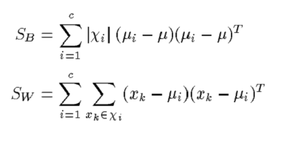

This ratio can be optimized by using:

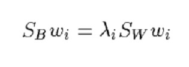

Support Vector Machines
-----------------------

After PCA and Fisher’s LDA were performed on the data, classification with support vector machines was tested. 

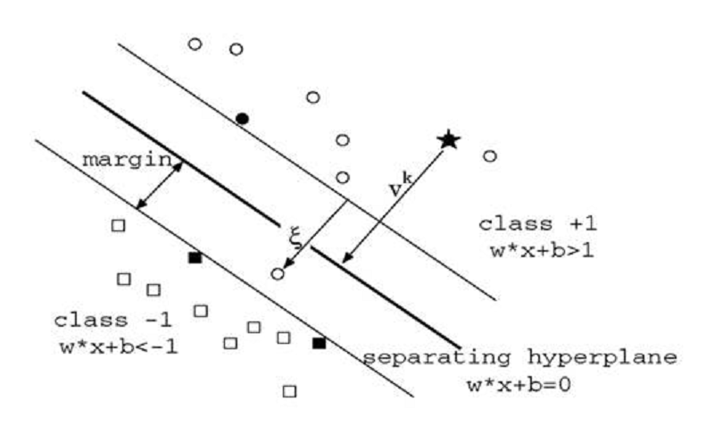

The linear decision surfaces are given by w*x+b = +/-1 and w is given by 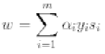 whe Si are the support vectors.  To find the optimal separation we need to solve:

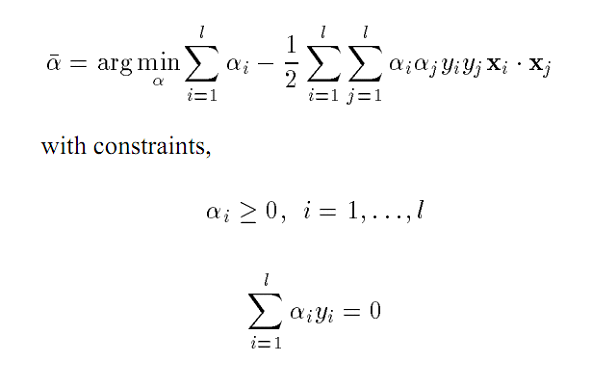

The face space spanned by the two most relevant feature vectors u1 and u2 can be seen  in the following figure [1]. This face space was used to perform SVM classification.

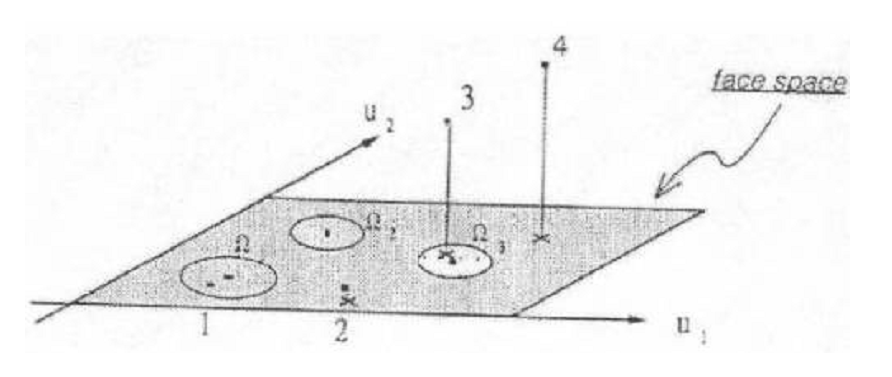

Several strategies to perform multi-class classification with SVM exist. The common "one-against-all" method is one of them. A bottom up binary tree classification was used in this project in order to reduce the problem to a two class problem. An illustration of the binary tree can be observed bellow [3]:

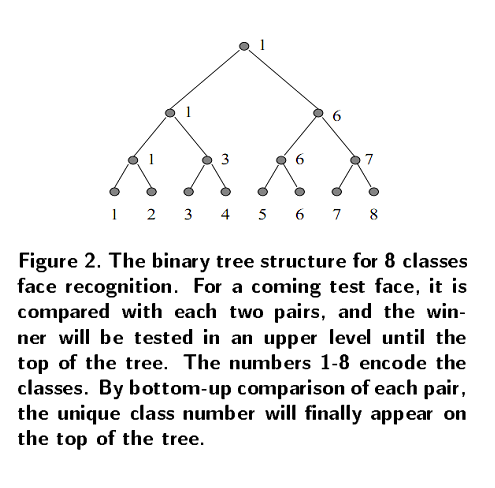

Results
=======

Several tests with faces from data.mat and pose.mat were conducted.  The first test was sorting the eigenvalues and selecting a range of eigenvalues and eigenvectors in order to observe the effect in face recognition. In the following figure we can observe a plot of the eigenvalues for PCA performed in data.mat. Clearly most of the relevant data is found in a range of about 15%. 

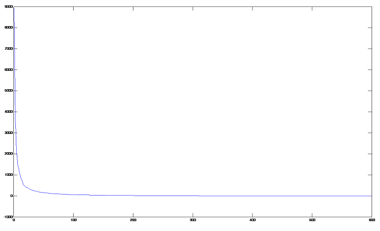

In the end, for optimization purposes, only the feature space spanned by the two most relevant eigenvectors was selected to conduct SVM classification.

Two classification methods were tested, nearest neighbour (Euclidean distance) and support vector machines. Both methods worked well for the two datasets. The difference is that with SVM a single class was selected, while with the nearest neighbour only the best match of the whole data set was selected. Some examples can are shown in the following figures:

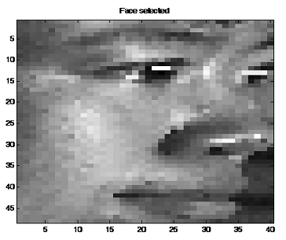

According to our SVM this face belongs to class 1:

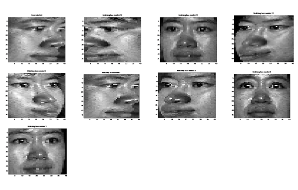

According to the nearest neighbour, we obtain the following face as the closest match:

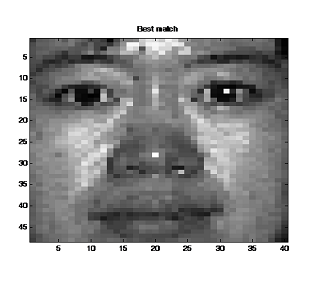

We conclude that reducing the dimensionality doesn’t really affect the reliability of the matching, but does increase the speed of the code dramatically. Support vector machines enable us to use kernel methods and define non-linear classification surfaces, which makes this method more accurate than the nearest neighbour. 

Running the Code
================

1.-Using the code is straightforward, you just have to select your dataset (pose.mat or data.mat). If you want to use a different data set you have to substitute the line that loads the data, and you have to make sure that the class/number of persons k, and the number of images per class n, are correct. 

2.-The data has to be in the form of a Rows*Columns*M matrix.

3.-The code implements the library LIBSVM. I did not included this library with the code.

References
==========

1. http://onionesquereality.wordpress.com/2009/02/11/face-recognition-using-eigenfaces-and-distance-classifiers-a-tutorial/

2. Eigenfaces vs. Fisherfaces: Recognition Using Class Specific Linear Projection, Peter N. Belhumeur et al., 1996 European Conference on Computer Vision

3. Face Recognition by Support Vector Machines, Guodong Guo et al. 